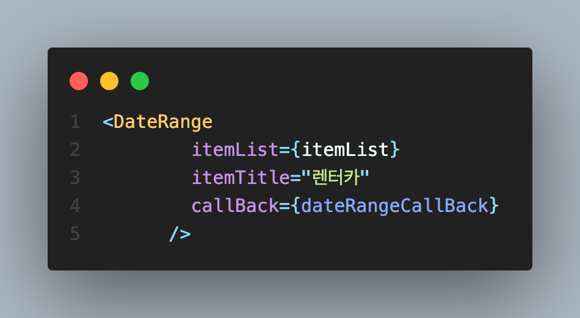
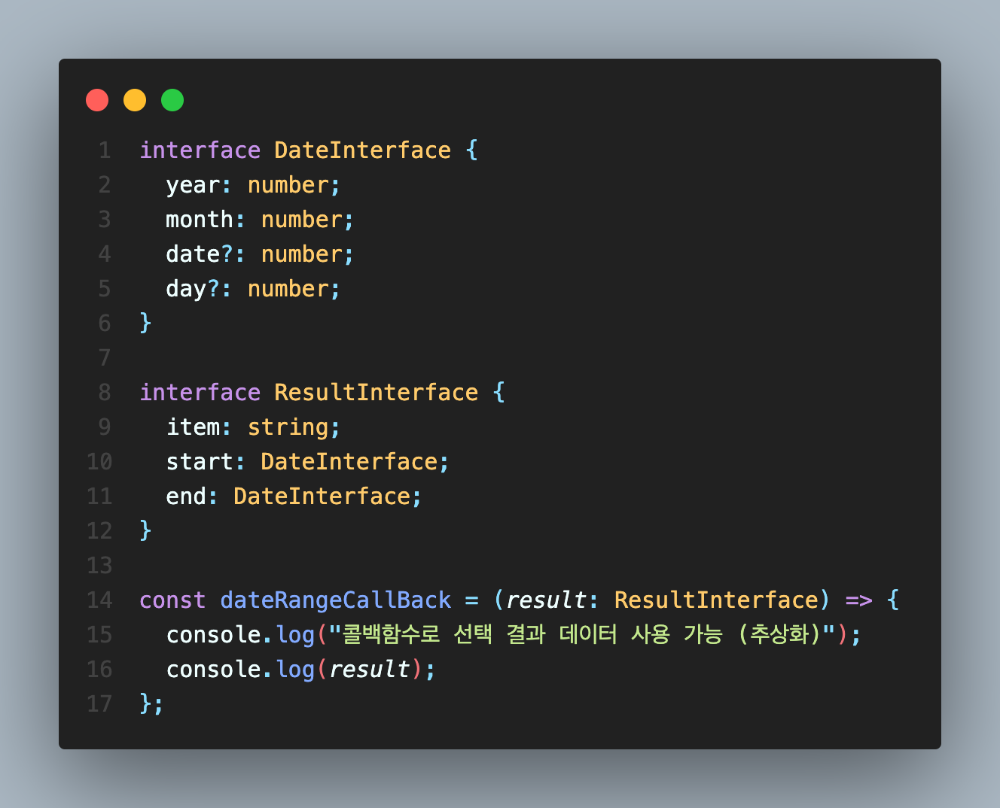

## Date Range (날짜 기간 선택)

 

> 날짜를 기간으로 선택하고 싶을 때 (시작일 - 마감일) 사용합니다.

 

### 요구 기능

1. 사용자가 선택한 연-월에 맞는 달력이 출력된다. (시작은 실제 날짜에 해당하는 연-월)

2. 시작일을 선택한다. 시작일을 선택하면 자동으로 마감일 선택으로 넘어간다.

3. 시작일이 선택된 상태에서 마감일이 선택되면 달력 상에 색칠된 상태로 기간을 표시한다.

4. 마감일부터 선택할 수 있다. 이 경우에는 마감일을 선택하면 시작일 선택으로 넘어간다.

5. 두 날짜를 모두 선택하고 결정 버튼을 누르면 시작일과 마감일의 정보가 callback 함수의 파라미터로 넘어가 실행된다.

6. 날짜 외에 다른 정보도 함께 선택하도록 하고싶을 수 있다. 이를 props로 받아 출력하고, 선택한 내용을 반환하도록 한다.

 

### 사용 예시

 

### 사용 방법

> itemTitle: 위의 사용예시의 '렌터카'와 같이, 사용자가 직접 제목을 설정합니다. 
> itemList: 사용자가 넣고 싶은 리스트를 넣습니다. (아직은 string[]만 사용 가능합니다.) 
> callBack: DateRange로 부터 반환된 결과를 받아올 수 있는 콜백함수입니다.

 

위의 3가지 항목을 모두 선택 완료한 후 오른쪽의 버튼을 누르면 콜백함수가 실행됩니다.

사용자는 이 콜백함수를 사용하여 결과 데이터를 자신이 원하는 방식으로 사용할 수 있습니다.

> [result 프로퍼티]  
> item: string 
> start: {year: number, month: number, date: number} (month의 경우 실제 달 - 1) 
> end: {year: number, month: number, date: number} (month의 경우 실제 달 - 1)
